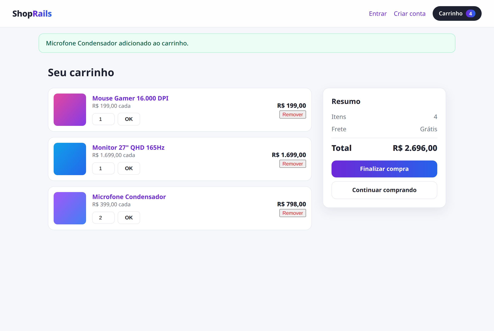
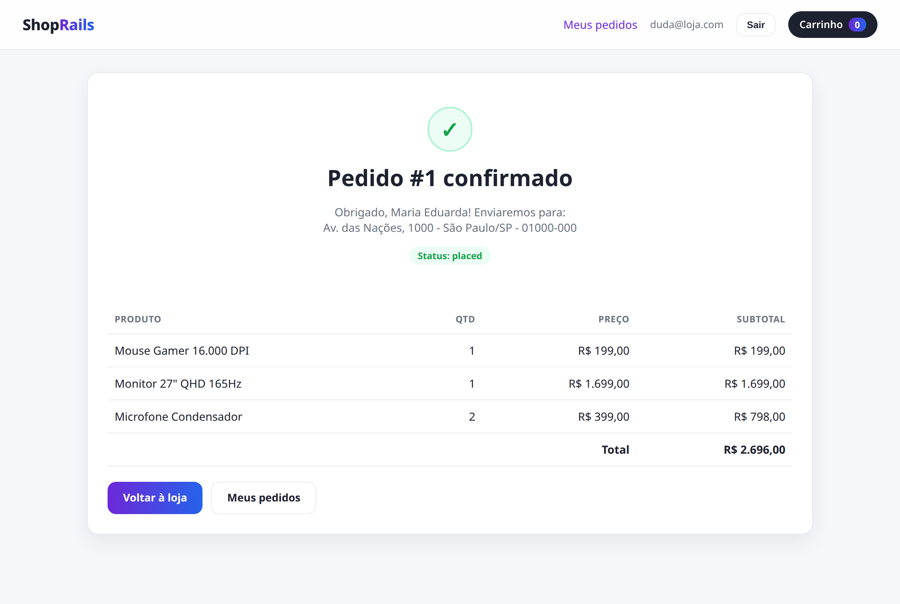
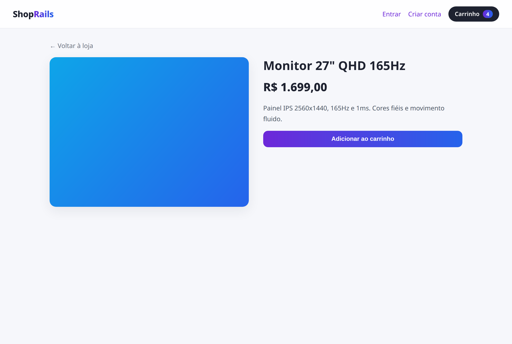

<div align="center">
  <h1>ShopRails</h1>
  <p><strong>Mini e-commerce completo construído com Ruby on Rails 8.</strong></p>
  <p>Catálogo de produtos, carrinho por sessão (funciona sem login) e checkout com pedido — autenticação, associações e transações de banco em um só projeto.</p>
</div>

<div align="center">
  
</div>

---

## Visão geral

O ShopRails é uma loja virtual funcional de ponta a ponta: o visitante navega pelo
catálogo, adiciona produtos ao carrinho (mesmo sem estar logado) e, ao finalizar a
compra, cria uma conta ou faz login para gerar o pedido. É o projeto que reúne os
principais pilares de uma aplicação Rails real:

- **Autenticação** nativa do Rails 8 (cadastro, login, logout).
- **Associações ricas** entre usuário, carrinho, produtos e pedidos.
- **Carrinho por sessão** — guardado por `session[:cart_id]`, então funciona para
  visitantes anônimos e é preservado ao fazer login.
- **Checkout transacional** — o pedido é criado dentro de uma transação, com snapshot
  do preço de cada produto no momento da compra.

## Telas

<table>
  <tr>
    <td width="50%" align="center"><strong>Carrinho</strong><br/><br/></td>
    <td width="50%" align="center"><strong>Confirmação do pedido</strong><br/><br/></td>
  </tr>
  <tr>
    <td width="50%" align="center"><strong>Detalhe do produto</strong><br/><br/></td>
    <td width="50%" align="center"><strong>Loja</strong><br/><br/></td>
  </tr>
</table>

## Modelo de dados e associações

```
User  1───*  Order  1───*  OrderItem  *───1  Product
                                              │
Cart  1───*  CartItem  *──────────────────────┘
```

| Modelo      | Associações                                                        |
|-------------|--------------------------------------------------------------------|
| `User`      | `has_many :orders`, `has_many :sessions`                           |
| `Product`   | `has_one_attached :image`, `has_many :cart_items`, `:order_items`  |
| `Cart`      | `has_many :cart_items`, `has_many :products, through: :cart_items` |
| `CartItem`  | `belongs_to :cart`, `belongs_to :product`                          |
| `Order`     | `belongs_to :user`, `has_many :order_items`, `:products, through:` |
| `OrderItem` | `belongs_to :order`, `belongs_to :product`                         |

Valores monetários são guardados em **centavos** (`price_cents` / `total_cents`) para
evitar erros de ponto flutuante; a formatação em reais fica em um único lugar.

## Funcionalidades

- Catálogo de produtos com imagem, descrição e preço
- Carrinho por sessão: adicionar, alterar quantidade e remover (funciona sem login)
- Contador de itens do carrinho na barra de navegação
- Checkout com login obrigatório e validação de endereço
- Pedido com snapshot de preço (alterar o preço depois não muda pedidos antigos)
- Histórico "Meus pedidos", restrito ao usuário dono

## Stack

| Camada           | Tecnologia                          |
|------------------|-------------------------------------|
| Linguagem        | Ruby 3.2                            |
| Framework        | Ruby on Rails 8.1                   |
| Autenticação     | Authentication nativa do Rails 8    |
| Imagens          | Active Storage                      |
| Front-end        | ERB + CSS (tema claro, responsivo)  |
| Banco            | SQLite (dev/test)                   |
| Testes           | Minitest                            |

## Como rodar localmente

Pré-requisitos: Ruby 3.2+ e Bundler.

```bash
# 1. Clone o repositório
git clone https://github.com/Dudainfinity/ShopRails.git
cd ShopRails

# 2. Instale as dependências
bundle install

# 3. Crie o banco e popule a loja com produtos de demonstração
bin/rails db:prepare
bin/rails db:seed

# 4. Suba o servidor
bin/rails server
```

Acesse `http://localhost:3000`, adicione produtos ao carrinho e finalize a compra.

## Testes

```bash
bin/rails test
```

A suíte cobre as regras de negócio (formatação de preço, carrinho que agrega quantidade
em vez de duplicar, criação de pedido com snapshot de preço e esvaziamento do carrinho)
e o fluxo HTTP completo (visitante navega, adiciona ao carrinho, checkout exige login,
pedido é criado e cada usuário só vê os próprios pedidos).

## Decisões de implementação

- **Carrinho por sessão, não por usuário** — o visitante monta o carrinho antes de ter
  conta; o login só é exigido no checkout. O `cart_id` vive na sessão.
- **Snapshot de preço no `OrderItem`** — o preço pago é copiado para o item do pedido,
  então mudanças futuras no catálogo não reescrevem o histórico de compras.
- **Criação do pedido em transação** — `Order.create_from_cart` cria pedido e itens
  atomicamente; se algo falhar, nada é persistido.
- **Dinheiro em centavos** — evita imprecisão de `float`; a formatação BRL é centralizada.
- **Índice único `(cart_id, product_id)`** — garante um item por produto no carrinho.

---

Desenvolvido por [Dudainfinity](https://github.com/Dudainfinity).
